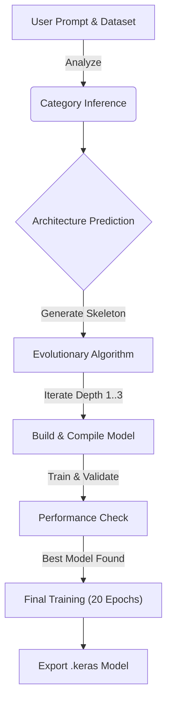

# 🧬 Hybrid Self-Evolving Neural Network


> **"An autonomous AI architect that designs, evolves, and trains neural networks tailored to your specific problem statement."**

## 🚀 Overview

The **Hybrid Self-Evolving Neural Network** is a cutting-edge AutoML system capable of generating, optimizing, and training deep learning architectures from scratch based purely on a **user prompt** and a **dataset**.

Unlike static model generators, this system uses an **evolutionary algorithm** to dynamically grow network depth, select optimal layers, and auto-correct input shapes, making deep learning accessible for complex tasks across multiple domains.

---

## ✨ Key Features

### 🧠 Evolutionary Core
*   **Dynamic Growth**: Starts with a predicted skeleton and evolves deeper architectures (Block-wise Evolution) to find the optimal structure.
*   **Smart Auto-Fix**: Automatically detects and fixes dimension mismatches:
    *   *2D Image (Grayscale)* → Reshaped to 3D.
    *   *Time Series / NLP* → Auto-expanded for sequence modeling.
    *   *Layer Sanitation* → Removes RNN layers from Image tasks and 2D Convs from Sequence tasks.

### 🌐 Multi-Domain Support
Supports a wide range of ML tasks out-of-the-box:
1.  **Image Classification**: (CNNs, GlobalPooling)
2.  **Image Segmentation**: (Encoder-Decoder logic)
3.  **Image Generation**: (Generator-only architectures)
4.  **Natural Language Processing**: (LSTM/GRU/Embedding layers)
5.  **Time Series Analysis**: (1D Convs, RNNs for regression/classification)

### 🔌 API-Driven Design
*   Built on a robust **Flask** backend.
*   **REST API** for predicting categories, generating architectures, and downloading trained models.

---

## 🛠️ How It Works



---

## 📦 Installation

### Prerequisites
*   Python 3.8+
*   `pip` and `virtualenv`

### Setup

1.  **Clone the repository**
    ```bash
    git clone https://github.com/mani30mk/Hybrid-Self-Evolving-Neural-Network.git
    cd Hybrid-Self-Evolving-Neural-Network
    ```

2.  **Create a Virtual Environment**
    ```bash
    python -m venv venv
    source venv/bin/activate  # On Windows: venv\Scripts\activate
    ```

3.  **Install Dependencies**
    ```bash
    pip install -r requirements.txt
    ```

---

## 🚀 Usage

### 1. Start the Backend
```bash
cd backend
python app.py
```
*Server runs on `http://localhost:5000`*

### 2. API Endpoints

#### `POST /api/predict-category`
Predicts the machine learning task based on a text prompt.
*   **Body**: `{"prompt": "Classify images of cats and dogs"}`
*   **Response**: `{"category": "Image Classification"}`

#### `POST /api/predict-architecture`
The core engine. Uploads data and triggers the evolution process.
*   **Form Data**:
    *   `prompt`: "Create a model to detect tumors"
    *   `category`: "Image Segmentation"
    *   `input_shape`: "128,128,1"
    *   `dataset`: (File: .zip for images, .csv for text/tabular)
*   **Response**: Returns the best architecture, validation accuracy, and download links.

### 3. Frontend
(Optional) If you are running the React frontend:
```bash
cd my-react-app
npm install
npm run dev
```

---

## 📂 Project Structure

```
self-evolvin-nn/
├── backend/
│   ├── app.py                 # Flask Entry Point
│   ├── self_evolving_algo.py  # Core Evolutionary Logic & Builders
│   ├── category_inference.py  # Intent Recognition Module
│   └── ...
├── model/                     # Pre-trained predictors (Skeleton/Category)
├── dataset/                   # Tokenizers and validation scripts
└── ...
```

---

## 🛡️ License

This project is licensed under the MIT License - see the [LICENSE](LICENSE) file for details.
